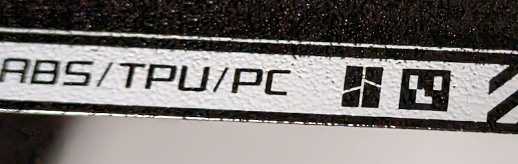
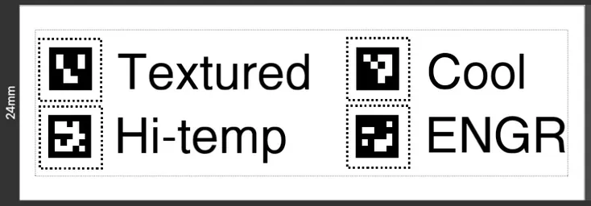

# About

Bambu Labs build plates have a small Aruco marker on them. This is used by the camera on the toolhead to programatically identify the type of build plate and make sure the correct one is loaded based on the material parameters.

You can see it here, to the right of the Bambu logo:



[These markers](https://docs.opencv.org/4.x/d5/dae/tutorial_aruco_detection.html) are visually similar to QR codes but much simpler, less information-dense, and have a different protocol than a QR code. Most QR code scanners cannot read Aruco markers, except for specialized computer vision scanners.

The marker used varies on the build plate type. There are 4 build plates that Bambu sells, for different materials. The table below shows the parameters of the Aruco markers that are found on the Bambu build plates.

| Plate type name  | Aruco dictionary size | Aruco marker ID |
|------------------|-----------------------|-----------------|
| Textured         | 4x4                   | 3               |
| High Temperature | 5x5                   | 2               |
| Cool             | 4x4                   | 0               |
| Engineering      | 5x5                   | 1               |



**The `individual` directory has the build plate marker images if that's all you care about.**

# Code

There's 2 Python scripts in the `src` directory:

1. `detect_aruco_image.py` - this performs detection of Aruco markers inside of images. You can use this to check that your build plate marker is correctly present.

2. `opencv_generate_aruco.py` - this generates an Aruco marker. Use this with the parameters in the table above if you have an aftermarket build plate and want to generate your own build plate marker for it.

Both scripts require [openCV](https://en.wikipedia.org/wiki/OpenCV).

To install, do:

```bash
$ pip install -r requirements.txt
```

## Usage

```
usage: detect_aruco_image.py [-h] -i IMAGE [-t TYPE]

options:
  -h, --help            show this help message and exit
  -i IMAGE, --image IMAGE
                        path to input image containing ArUCo tag
  -t TYPE, --type TYPE  type of ArUCo tag to detect

```

----

```
usage: opencv_generate_aruco.py [-h] -o OUTPUT -i ID [-t TYPE]

options:
  -h, --help            show this help message and exit
  -o OUTPUT, --output OUTPUT
                        path to output image containing ArUCo tag
  -i ID, --id ID        ID of ArUCo tag to generate
  -t TYPE, --type TYPE  type of ArUCo tag to generate
```

## Testing

The `test` directory has some examples of images with Aruco markers to use for testing purposes.