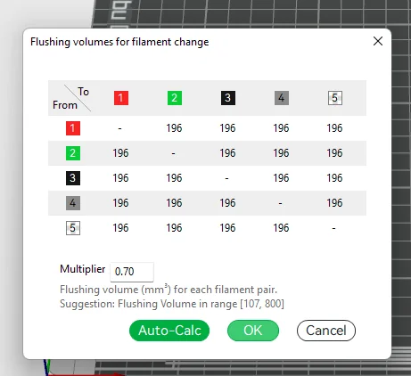

# About

This directory contains flush volume information from the Bambu Studio installation.

The files come from this directory:

```
C:\Program Files\Bambu Studio\resources\flush
```

They are used to help the printer know how much filament to flush when doing filament color changes.



You can find more info about flushing volumes [here](https://wiki.bambulab.com/en/software/bambu-studio/reduce-wasting-during-filament-change)

# Data format

At the core of it, flushing data consists of 3 things:

* The starting color (a hex code)
* The ending color
* How much volume (in units of mm^3) of filament to flush when doing this color change

My understanding is that the Bambu Studio algorithm assumes flush volumes are the same across filament, i.e. changing from dark red to light blue in PLA will require the same amount of filament to be flushed as if it was PETG instead of PLA.

